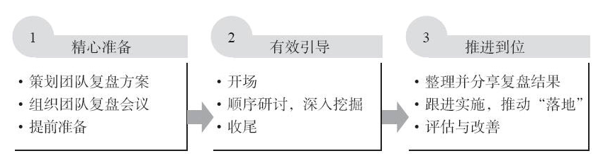

## 为什么要读这本书
> 朋友的老板推荐了几本书，这本是其中之一。正好在春节期间要做回顾与总结，现学现用
- 人生的所有阶段，都要不断学习

## 这本书讲了些什么

- 作者：邱昭良

### 复盘与总结的区别
- 总结主要用于做绩效评估，总结取得的成绩，不必然包含深层次的分析、提炼经验教训
- 复盘包含回顾目标，分析，提炼，转化应用
- 复盘更适合以团队形式进行
- 复盘必须亲身经历

### 复盘和PDCA的区别和联系
- PDCA是为了推进工作、解决问题
- 复盘是为了学习

### 复盘的分类
- 从参与人的维度
  - 个人
  - 团队
  - 组织

- 从复盘对象的维度
  - 事件/活动
  - 项目/任务
  - 整体经营/战略

- 综合参与人与复盘对象的分类
  - 个人复盘
  - 团队复盘
  - 项目复盘
  - 经营与战略复盘

### 个人复盘
- 新的事，重要的事，有价值的事，未达预期的事
- 两种方法：简易复盘，找一个教练

### 团队复盘
- 非正式，简单快速
- 正式：计划，准备，执行，跟进

#### 复盘的一般步骤

#### 三阶九步法

### 项目复盘
- 迭代
- 分层级，分阶段

### 经营与战略复盘
- OKR

## 有什么感想
- 个人复盘找一个教练是好办法
- 团队复盘引导很关键
- 各种方法论的思考，始于一组自问自答的关键问题，然后分类，自下向上和自顶向下的思考，也就是运用金字塔原理中的工具

## 如何运用这本书
- 实践曾国藩的复盘
- 重视战略复盘