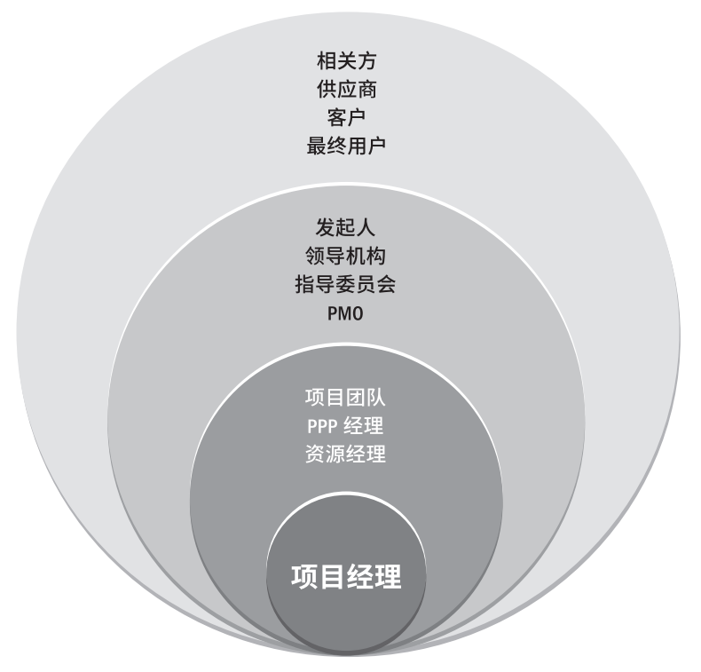
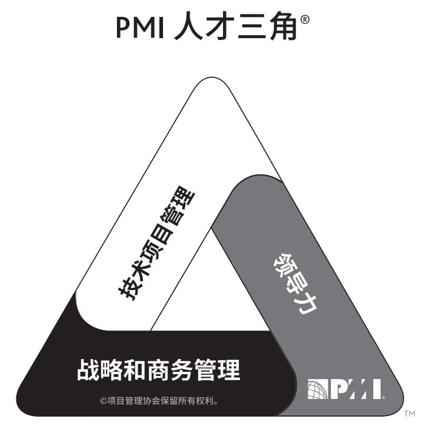

| 节                     | 说明 | 陕西地点   | 人       | 动作     | 联想                     |
| ---------------------- | ---- | ---------- | -------- | -------- | ------------------------ |
| 1.概述                 |      | 渭南华山   | 司马迁   | 华山论剑 | 华山论剑雄视天下         |
| 2.项目经理的定义       |      | 商洛金丝峡 | 贾平凹   | 写小说   | 贾平凹陕西作家项目经理   |
| 3.项目经理的影响力范围 |      | 安康       | 怀让禅师 | 磨砖成镜 | 怀让影响南方，日本，范围 |
| 4.项目经理的能力       |      | 汉中       | 张骞     | 丝绸之路 | 张骞开创丝绸之路，能力   |
| 5.执行整合             |      | 宝鸡       | 白起     | 灭六国   | 白起整合六国             |

## 概述

- 成员与角色
- 在团队中的职责
- 知识与技能
  - 通才，基本知识
  - 项目管理知识，技术知识，理解和经验。
  - 沟通，书面沟通

## 项目经理的定义

- 项目经理是由执行组织委派，领导团队实现项目目标的个人

## 项目经理的影响范围

- 概述
  - 
- 项目
- 组织
- 行业
- 专业学科
- 跨领域

## 项目经理的能力

- 概述
  - 

- 技术项目管理技能
- 战略和商务管理技能
- 领导力技能

## 执行整合

- 过程层面
- 认知层面
- 背景层面
- 整合与复杂性：系统行为，人类行为，不明确性