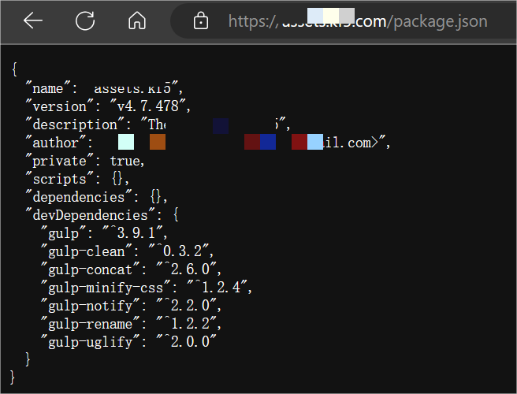
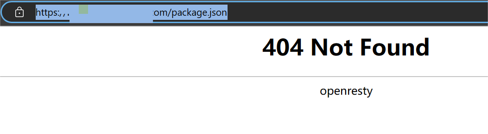
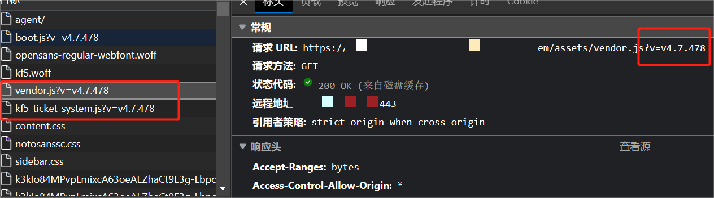

## **起因**

- 某项目扫描工单系统漏洞，发现网站根目录下的package.json可被访问，存在风险。要求修复。如下：

	        

- 所以在nginx上做了屏蔽

```
 location = /package.json {
        return 404;
 }
```
        

## **问题**

- package.json中的参数，version是有作用的。现在屏蔽掉，会不会有严重影响？
- 前端静态资源文件，依赖version解决缓存问题

	        


## **疑惑**

- 实践证明，即使nginx屏蔽不能访问package.json了，前端静态文件的版本号，依然正常工作
- 为什么呢？浏览器访问不到了，js如何渲染，难道是js服务端渲染？

## **解惑**

- [服务端渲染 (SSR) | Vue.js (vuejs.org)](https://cn.vuejs.org/guide/scaling-up/ssr.html)

- 通读js服务端渲染的原理，基于node.js，和其他后端语言的服务能力一样，服务端生成静态文件，返回给前端
- 我们的网站部署在nginx下面，没有用到node.js引擎，不存在服务端渲染
- 继续探究前端是如何实现版本号的
	[gulp之自动化静态资源压缩合并加版本号 - 腾讯云开发者社区-腾讯云](https://cloud.tencent.com/developer/article/2047177?from=15425)

- 答案：前端在编译阶段，给静态资源加上了版本号。package.json在编译之后可以丢弃